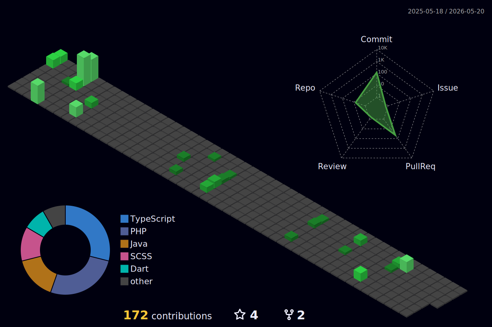

## 💻 About Me

Hi, I’m Augusto de Camargos Zanoli, a Computer Information Systems student at UNIFEI (Brazil) passionate about building software that creates real impact and connects people.

I currently serve as Vice President of the Computer Science Student Directory and have hands-on experience in a Junior Enterprise, where I worked on real-world projects and developed strong teamwork and leadership skills.

My main stack is Java (Spring Boot) and Angular, focusing on full-stack applications built with clean architecture, scalability, and long-term maintainability in mind. I care about writing code that makes sense, not just code that works.

I’ve also earned medals in OBI and OBR, which strengthened my foundation in logic, algorithms, and problem-solving from an early stage.

Always learning. Always building. 🚀

---

  
  

  
 |  |  |  
 | ----------- | ----------- |

 
  

    
  

 
##
   

     
  

  
