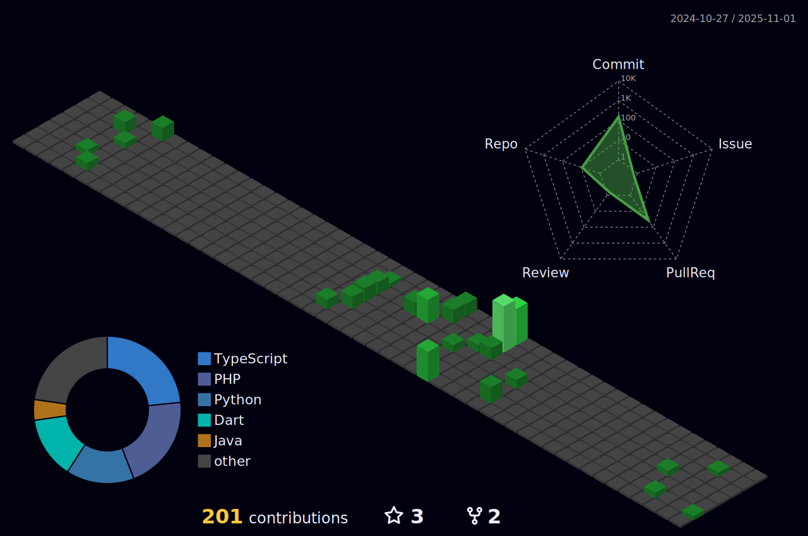

## 👋 Olá! Eu sou o Augusto Zanoli

Sou um desenvolvedor full-stack apaixonado por tecnologia, inovação e mobilidade digital. Tenho experiência com Flutter, PHP, bancos de dados, e estou sempre buscando novos desafios, especialmente no desenvolvimento de soluções com foco em usabilidade, performance e integração com hardware.

🚀 Atualmente estou atuando como desenvolvedor full-stack, utilizando tecnologias como Java, SpringBoot e Angular.

---

  
  

  
 |  |  |  
 | ----------- | ----------- |

 
  

   

  

 
##
   

     
  

  
